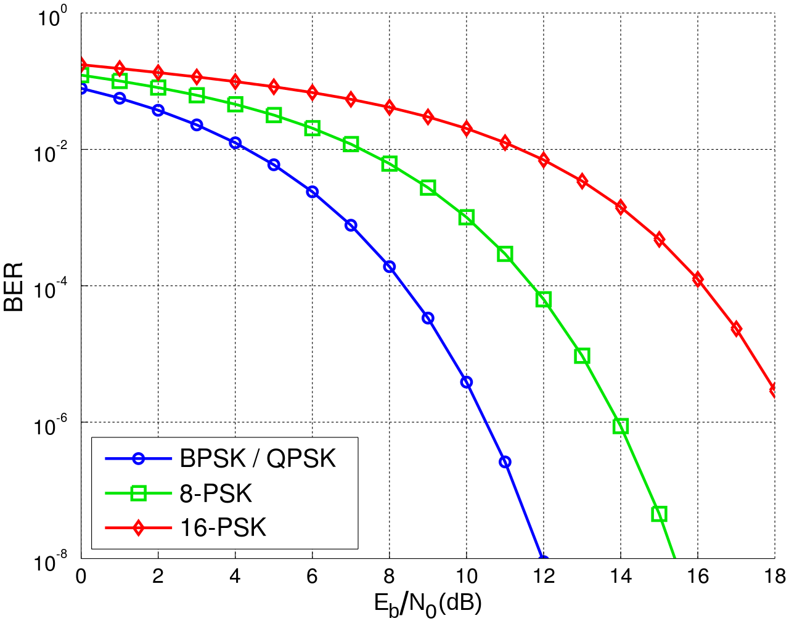
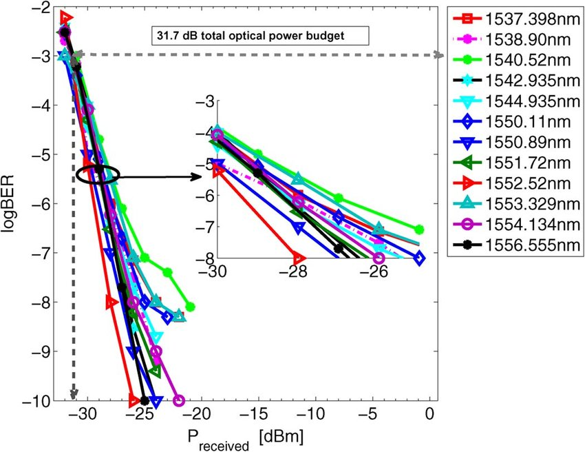

## BER_dB_sensitivity

[bit error rate (BER)位元錯誤率](https://zh.wikipedia.org/zh-tw/%E6%AF%94%E7%89%B9%E8%AF%AF%E7%A0%81%E7%8E%87)

指單位時間差錯位元的數量  
通常以百分比的形式表示

```
舉一個例子，假設傳輸的位元序列為：
0 1 1 0 0 0 1 0 1 1
而接收到的位元序列為：
0 0 1 0 1 0 1 0 0 1,

在本例中，差錯位元（加底線的位元）的數量為3。誤碼率為差錯位元數3除以傳輸的位元數10，也就是0.3或者30%。
```

---  

在光通信模組中，`BER` 代表位元錯誤率（Bit Error Rate）  
而 `db sensitivity` 則指的是接收端的靈敏度，通常以分貝（dB）為單位  
因此，`BER db sensitivity` 的意思是  
指 `光通信模組能夠在特定的位元錯誤率下 接收並辨識出的最低光信號強度`  
這個數值越小，代表模組越能夠在較低的光信號條件下正確地解讀資料。  

  

BER 取了 `log對數`  似乎會變成直線  



---
### 光通信模組能夠在特定的位元錯誤率下 接收並辨識出的

#### 我們自家的做法  聽說是  


BER = 2.4E-4    
但我以前聽到的是 5E-5

所以 量測的現況應該是  

假設
用 `1dBm`  去測  Bert上會測出誤碼值  
如果誤碼值 `小於5E-5`  表示我們  還可以用大一點的衰減值

用 `2dBm`  去測  Bert上會測出誤碼值  
如果誤碼值 `小於5E-5`  表示我們  還可以用大一點的衰減值  
...  
...  
用 `7dBm`  去測  Bert上會測出誤碼值  
如果誤碼值 `大於5E-5`  
表示我們的`sen`  會落在 `6 ~ 7 之間`


### `看起來是個很耗時的量測`

---

### `這段是問chatGPT`

 "BER db sensitivity" 量測中確實存在一些量測方法  
 其中包括了 "內差法"（Interpolation Method）和 "Go/No-Go 測試"（Go/No-Go Testing）。

1. **內差法（Interpolation Method）：** 在進行 BER（位元錯誤率）與靈敏度之間的關聯性測試時，可能會使用內差法來計算不同 BER 值對應的信號強度閾值。這涉及到量測不同 BER 水平下的訊號強度，然後使用內差技術來推算出其他 BER 值所對應的訊號強度閾值。這可以幫助確定特定 BER 水平下的靈敏度。

2. **Go/No-Go 測試（Go/No-Go Testing）：** 在 BER db sensitivity 測試中，Go/No-Go 測試是一種二元測試方法。在這種方法中，系統將測試信號輸入光通信模組，然後根據預定的 BER 閾值來判斷測試是否通過。如果模組在給定的訊號強度下可以達到所需的 BER，那麼測試結果就是 "Go"（通過），否則為 "No-Go"（未通過）。這種方法能夠快速判斷模組的性能是否符合要求。

這些方法都是在 BER db sensitivity 量測中常見的技術，用於評估光通信模組在不同訊號強度條件下的性能。不同的情況下可能會選擇不同的測試方法，以便更全面地評估模組的性能特性。

---
總體看來  
內差法  外插法  就是純粹的數學算法   沒有特別的意思  
Go/No-Go   才是  非數學的內容   需要理解  
