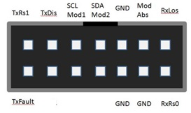

EVB_Evaluation Board 測試板
===
常見問題
* SFP/QSFP/etc 接頭磨損: 插到底信號更差, 要拉出 ~1mm + 斜角:
* 初級: Electrical-Eye Eye-Height不良
* 嚴重: I2C 連不到
* SMA 街頭後面螺絲不緊
* BER Test 不良
* E-Eye Amplitude/Height 低下 (?)
* SFP/QSFP/etc 接頭卡導線, 短路
* SFP/QSFP/etc 接頭斷線
* SDI Wrong board: may brick device
* QSFP OBM Switch Issues: see 40G_OBM

---
## iLink 測試版

SFP28  
  
  

---
QSFP28
  

