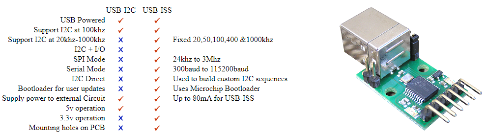
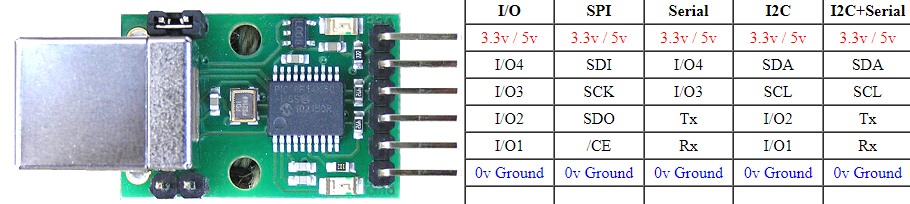
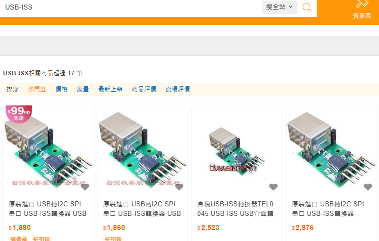
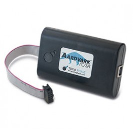
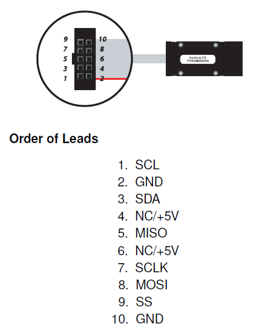

## USB-ISS
### 目前公司內部使用 種類
  
##  

### 公司內部使用 無法任何更換 晶片不同  公司內部程式會無法運作  程式碼需多寫底層
  
##
[USB-ISS  Multifunction USB Communications Module](https://www.robot-electronics.co.uk/htm/usb_iss_tech.htm)
##
## AARDVARK I2C/SPI HOST ADAPTER  
  
The Aardvark I2C/SPI Host Adapter is a fast and powerful I2C bus and SPI bus host adapter through USB. It allows a developer to interface a Windows, Linux, or Mac OS X PC via USB to a downstream embedded system environment and transfer serial messages using the I2C and SPI protocols.  

