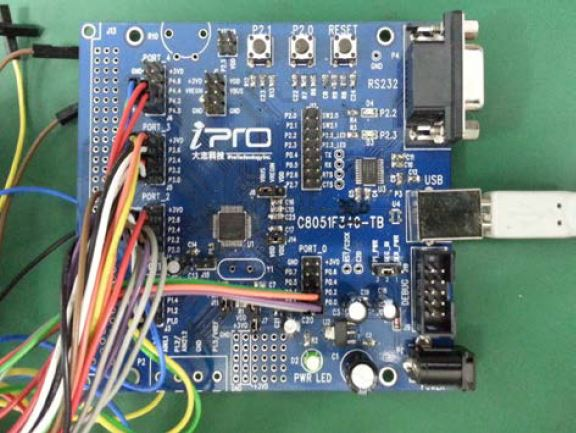
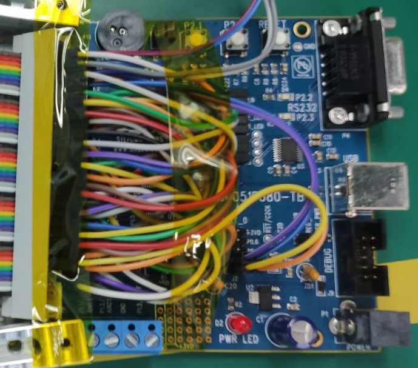
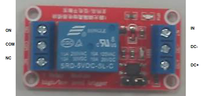
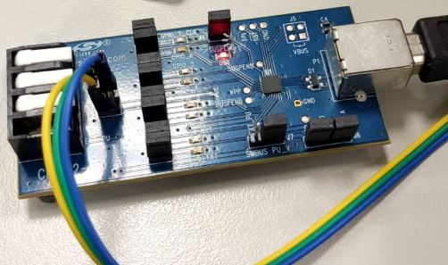

I2C
===
## USB-ISS
>目前公司內部使用 種類

  


公司內部使用 無法任何更換 晶片不同  公司內部程式會無法運作  程式碼需多寫底層  
[USB-ISS  Multifunction USB Communications Module](https://www.robot-electronics.co.uk/htm/usb_iss_tech.htm)


---
## AARDVARK I2C/SPI HOST ADAPTER  
  
```
The Aardvark I2C/SPI Host Adapter is a fast and powerful I2C bus and SPI bus host adapter through USB. It allows a developer to interface a Windows, Linux, or Mac OS X PC via USB to a downstream embedded system environment and transfer serial messages using the I2C and SPI protocols.  
```
  

看 SFF_Utility 內的 DeviceAPI.cs 看細節  
目前寫入法: Direct 沒有修飾

目前附加功能:

* 用原廠軟體直接讀寫
    * I2C Slave 功能
* GPIO Pin High Low: 用在 SDI 2T 燒錄
* Ada Fruit I2C Mux 控制
Driver: totalphaseusb-v2.16
Pull Up Resistor 2.2k Ohms, Can disable

---
## F38x
  
自行開發Firmware的 I2C 版: 有版本差異: V34 版加了 ADC 功能, 量測軟體會需要用到.
```
用Silicon Labs Adapter + 板上 JTAG燒錄. 燒錄檔 Blink_Control_F380.hex 可在 SFF_Utility BurnHex 中找到. (z-F38x_TestBoard)
Make sure there is power (see pwr LED) before burning.
注意: Jumper VBUS VREGIN 在新來版為 Open, 燒錄完要接起來.
其他Jumper: J7, J10, J11 要連起來:
注意: Jumper Reg_In-SER_PWR 要連還是連 P1_PWR (待確認)
當 OBM 測試版: 4 Channel I2C, GPIO Pin 多組, ADC Convert
```
當 OBM 測試版 BUG: 
>於 SFF_Utility 開啟 Test F380 IO “440” 於 OBM SM 測試導致 I2C 關閉, Power 不穩

基本上用在 `1G/10G` OBM 或 `40g_obm`

Firmware 看 SVN 內的 `F38xOBM_GDevice` (?) 看細節

IO 看 SFF_Utility 內的 `SFF_F38_IO` 看細節

還要看 QSFP_FinalTest

硬體資料分類應為: C8051F34x Development Kit 相關, 可看:
```
\\egoserver\共同區\共用-技術中心\儀器設備\C8051F34x-DK.pdf \\egoserver\共同區\共用-技術中心\儀器設備\C8051F38x-DK.pdf
```
Silicon Labs F380 Devboard 長相如下:
  
May have compatiblity issue with 100G SR4 2.x~5.x Version. To check

---
## 電源控制Relay接線
電晶體 Relay  
  
接線到 I2C Adapter:  

DC+: 5.0V
* USB-ISS: 邊角電源 pin, 檢查 jumper 是否設定 5V 正確
* Aadvark: pin 4
* F38x: 未定:自己想辦法

DC-: Ground
* USB-ISS: Ground
* Aadvark: Pin 10 ground
* F38x: 未定:自己想辦法

In:
* USB-ISS: I/O_1
* Aadvark: Pin 5
* F38x PIN: 0,6

On: Power Supply 3.3V
Com: TestBoard 3.3V

預設Jumper: 如圖

---
## CP2112
  

Formerica 目前不使用 CP2112 I2C, 不過 SFF_Utility 可以透過 HID 與其溝通

---

