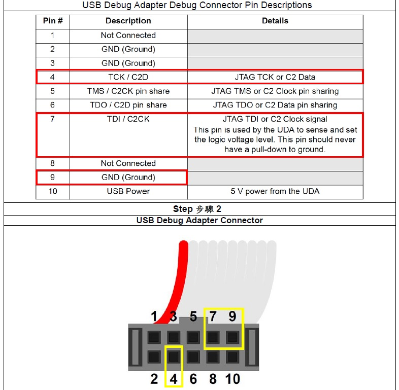
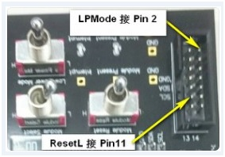
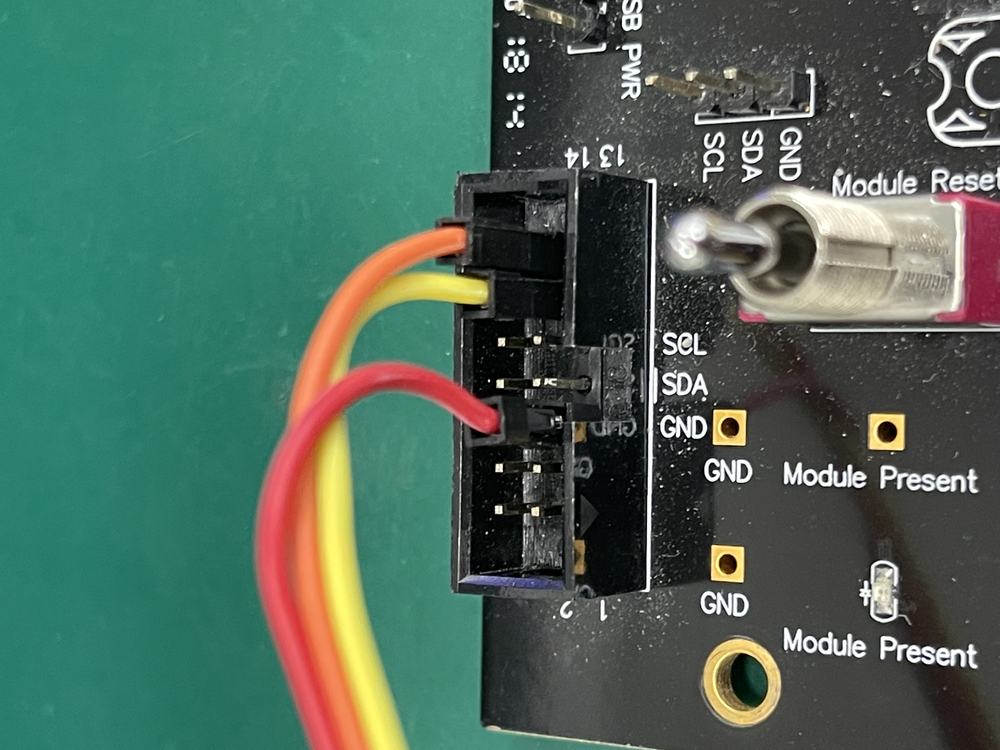
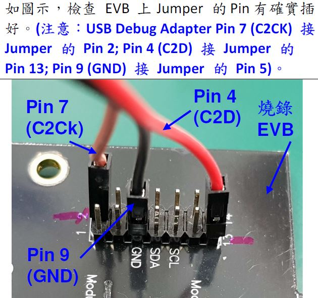
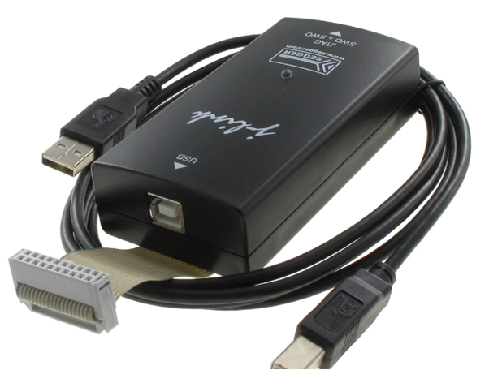

線上仿真器（In-Circuit Emulator 簡稱：ICE）
===
線上仿真器（英語：In-Circuit Emulator，簡稱：ICE）是除錯嵌入式系統軟體的硬體裝置。嵌入式系統開發者要面對一般軟體開發者所沒有的特殊問題，因為嵌入式系統往往不像商業電腦那樣具有鍵盤、螢幕、磁碟機和其他各種有效的使用者介面和儲存裝置。線上仿真器通過處理器的額外輔助功能，使系統在不失去其功能的情況下，提供除錯功能。歷史上，由於處理器能力有限，這通常意味著將其處理器臨時更換成一個硬體仿真器。硬體仿真器是普通處理器的特製版本，內部設有多種額外的除錯訊號，以便提供處理器內部狀態的資訊。

---
## Silicon Labs Adapter  


* \\egoserver\文管中心\現行文件\三階文件\製造部\W00-PE382 QSFP+, QSFP28 系列產品韌體 (Firmware) 燒錄作業指導書-中英版
* \\egoserver\文管中心\現行文件\三階文件\製造部\W00-PE368 SFP+, SFP28 系列產品韌體 (Firmware) 燒錄作業指導書
* \\egoserver\文管中心\現行文件\三階文件\製造部\W00-PE429 12G、24G SDI 系列產品韌體 (Firmware) 燒錄作業指導書
* \\egoserver\文管中心\現行文件\三階文件\製造部\W00-PE481 12G SDI Non-MSA 2T 系列產品韌體 (Firmware) 燒錄作業指導書
* \\egoserver\文管中心\現行文件\三階文件\製造部\W00-PE472 12G SDI Non-MSA 2R 系列產品韌體 (Firmware) 燒錄作業指導書
* \\egoserver\文管中心\現行文件\三階文件\製造部\W00-PE343 OBM系列-Firmware燒錄及確認電流作業指導書-中英版  

  
40G/100G SR `download pin` → pin2, pin11 and GND and 3 switches need `to be switched to middle`.
```
EVB Board:
Pin 2 to Silicon Labs pin 4
Pin 11 to Silicon Labs pin 7
```

  
25G `download pin` → new EVB pin2, pin13 and GND - > old EVB pin2, pin4 and GND

---
## J-Link ICE Adapter for Mentech 400G SR8  

* \\Egoserver\共同區\共用-品保部\20220630 400G 測試相關\SOP