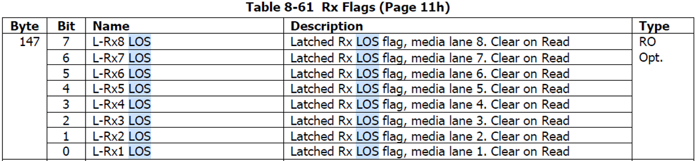

## LOS_Assert_DeAssert
在光通信領域中，"LOS" 和 "LOL" 是兩個不同的縮寫，代表著不同的概念：

1. **LOS：** "LOS" 是 "Loss of Signal" 的縮寫，中文意思是「訊號丟失」。在光通信中，當光信號的強度降低到一個無法辨識的程度時，就稱之為 "Loss of Signal"。這可能是由於訊號在傳輸過程中受到衰減、散射或其他干擾因素影響所致。當 LOS 發生時，接收端無法正確解讀來自發送端的訊號，可能會導致資料的錯誤或中斷。

2. **LOL：** "LOL" 是 "Loss of Lock" 的縮寫，中文意思是「鎖定丟失」。在光通信中，LOL 通常與光收發器的鎖定狀態有關。光收發器需要與傳送的光信號保持同步，這種同步稱為鎖定。如果光收發器失去與信號的同步，就稱為 "Loss of Lock"。這可能是由於光信號變化過大、干擾或其他因素導致的。LOL 的發生可能會影響到信號的穩定性和品質。

總之，LOS 是指光信號的強度降低到無法辨識的程度，而 LOL 則是指光收發器失去與信號的同步。這兩個概念在光通信中都與訊號的品質和穩定性有關。

---
`DeAssertLOS`  
一般來說是由 小到大    監看何時信號出現   出現點就是 LOS DeAssert

`AssertLOS`  
一般來說是由 大到小    監看何時信號消失   消失點就是 LOS Assert

以下是CMIS 規範  

---

#### L16
目前看起來就是設一個起點讓他一直跑   哪個ch出現就紀錄  
終就是要   所有ch都跑完  才能收工

依觀察  是  上下兩格就是上下限  即-5~-15  中間   每 0.5跳一次