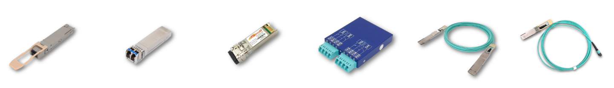

FOEwiki  http://ego:8800/doku.php
===
  
  

---

[EEPROM](/EEPROM/EEPROM.md)  
[I2C](/I2C/I2C.md)  
[ICE](/ICE/ICE.md)  
[EVB_Evaluation Board 測試板](EVB/EVB.md)

[SFF_Utility](/SFF_Utility/SFF_Utility.md)  
[外購產品密碼](/outsourcing/outsourcing.md)

---

RD管理的生產系統  
MFG_SN 產品序號管理  
SFF_Utility 多功能產品處理  
SFF_FinalTest =< 10G 產品終測  
QSFP_FinalTest OBM 產品終測  
Subversion原始碼管控  

---  

### YR 紀錄
[BER_dB_ sensitivity](BER_dB_sensitivity/BER_dB_sensitivity.md)
