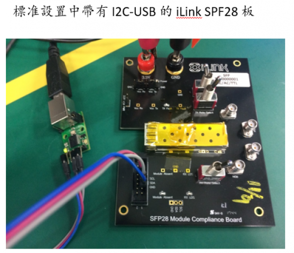

外購產品密碼
===
## Model : TCW-Q1LAA-F82 (40G/LR4) 外購供應商Smartlink A0A2密碼 (Jonas_20221108)
A1 B2 C3 D4

---
## Default MSA Password
00 00 10 11

---
## Innolight
00 00 10 11

---
## 外購 10G SR
00 00 10 11

---
## Centera
AA 55 A5 5A
(unlock available for 40G)

---
## usenlight
佑勝qsfp密碼修改
佑勝設定修改
25G LR
A0 Password 02020202
A2 Password 22 24 28 27
*usenlight 100G CWDM4 相容問題
*usenlight 100G CWDM4 equalizer 控制 (V2.40+)
*usenlight FW 版本表

---
## 江蘇博通
100G LR4
C0 C1 C2 C3 通过0xA0的0x7B,0x7C,0x7D,0x7E寄存器解码，通过0x77,0x78,0x79,0x7A重新输入密码，更改密码。
100G CWDM4
80 81 82 83
778899AA__ACM762(TGW-Q14BB-FCT)

---
## 廈門施碼:
100G CWDM
FC54D402
10G LRM
416E6479

---
## 成都迪譜 (XFP, PON)
9B 1F 2C A9
9B AF 2C A9

---
## Ascent Optics:
100G: A0 7B 51 53 46 50
25G BIDI: 77636F64
10G (SR?): Unlock
10G BIDI: Unlock
1G BIDI: Unlock
1.25G RJ45: Unlock
10G RJ45: 63737777

---
## 紹興中科
10G BIDI 15km
48 4F 53 54
10G RJ45: 63737777 (????)

---
## JPC
To Read I2C Connect both sides Unlock/Hardware lock for 10G

```
\\egoserver\共同區\共用-技術中心\產品資料\JPC_10G_DAC_EEPROM_Write.pptx
```

Special Write Method of Mini-SAS AOC Mini-SAS FW Read method
>ssA07301wwggA01302

Other RJ45
>Unlock normally

---
## Aimvalley (Smart SFP over E1)
>00 00 10 11

---
## Optech
>BIDI:  
01030709  
12345678

---
## MCURICH
QSFP DAC: 須使用客製燒錄板
- Not all products available for write: check before ordering!

---
## FOE SMART LINK
BIDI: TBD-A2E21-GCF, TBD-A2E11-GCF, TBD-A2E11-FCF, TBD-A2E21-FCF
ABACADAE

---